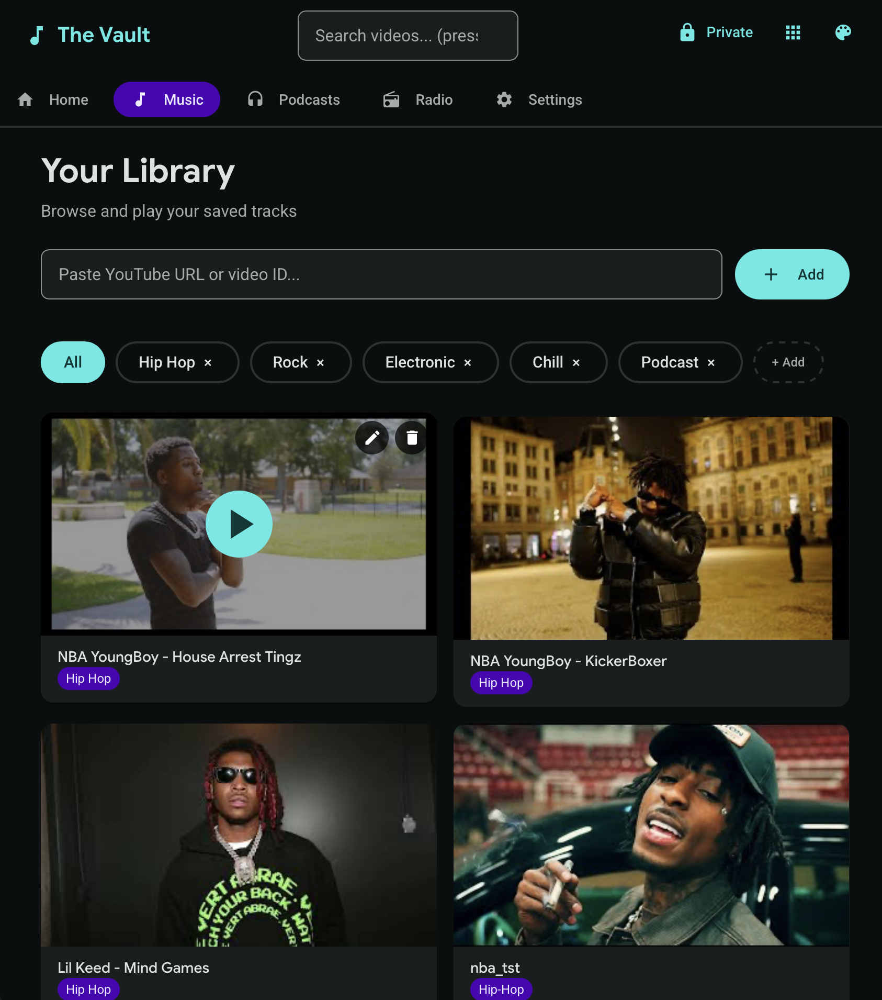
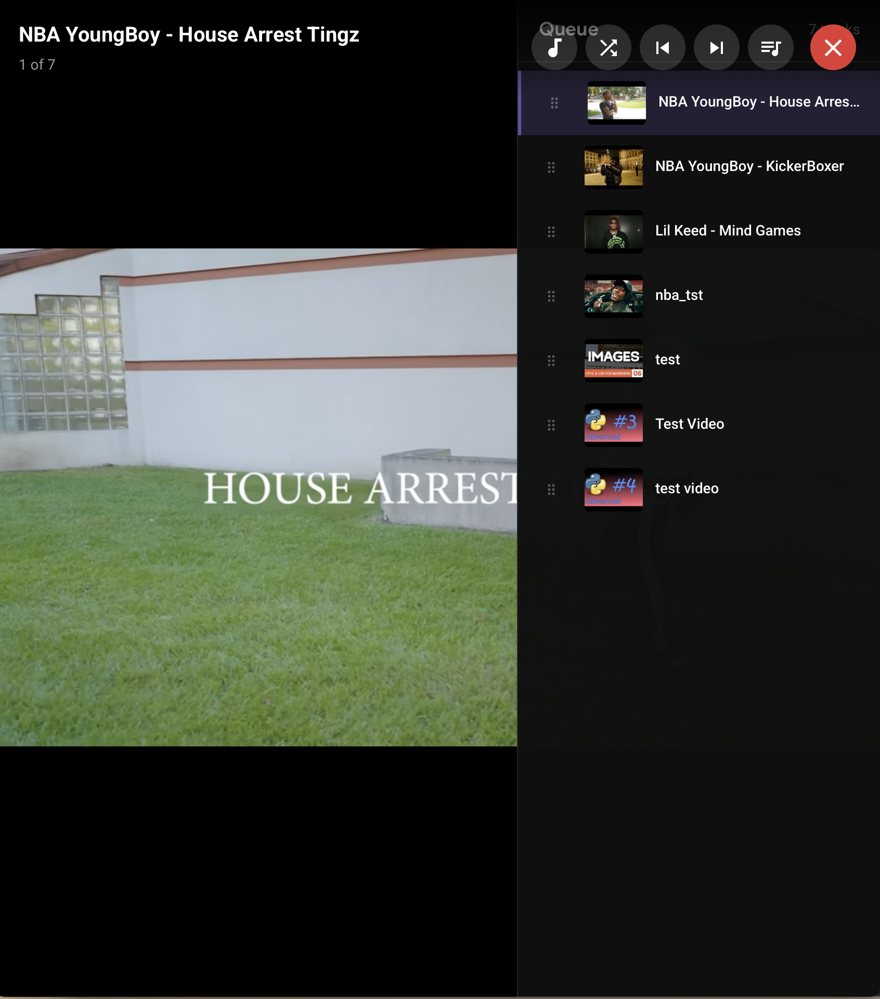

# The Vault - Your Personal Music Library

**The Vault** is a private, server-based music player that turns YouTube into your personal, ad-free library.   
It runs as a Node.js server with an HTML frontend, allowing you to curate, organize, and play your tracks without ads, tracking, or interruptions.

## Screenshots

### Home


## Features

- **Ad-free YouTube playback** using youtube-nocookie.com embeds
- **No tracking or analytics** - privacy first
- **Add videos by URL or video ID** with title, artist, category, and privacy settings
- **10 Professional themes** with Material Design 3 styling
- **Video categorization system** (Hip Hop, Rock, Electronic, Chill, custom categories)
- **Full-screen player** with queue sidebar and playback controls
- **5 Visualizer modes** - Bars, Wave, Particles, Sphere, Kaleidoscope
- **Auto-play** with shuffle and repeat options
- **Edit/delete videos** with modal editor
- **LocalStorage persistence** with automatic cleanup
- **Save/load collections** as JSON files
- **Public/Private mode** toggle for hidden videos
- **Responsive design** with grid/list view
- **Keyboard shortcuts** for quick navigation

## Quick Start

### Requirements
- Node.js 16+ installed ([Download here](https://nodejs.org/))
- Python 3 (for the launcher)

### Launch Methods

#### macOS
Double-click `scripts/launch_vault.command` or run:
```bash
./scripts/launch_vault.command
```

#### Windows
Double-click `scripts/launch_vault.bat` or run:
```cmd
scripts\launch_vault.bat
```

#### Any Platform (Python)
```bash
python3 scripts/launch_vault.py
```

#### Using npm directly
```bash
npm start          # Start server on port 8888
npm run vault      # Start + open browser
npm stop           # Stop server
```

After starting, open http://localhost:8888 in your browser.

## Usage

### Adding Videos
1. Paste a YouTube URL or video ID in the input field
2. Click "Add Video"
3. Enter a title when prompted
4. Choose a category
5. Optionally mark as private

### Managing Your Collection

**Categories**
- Filter videos by clicking category pills
- Create custom categories with "+ Add" button
- Delete categories you no longer need

**Saving Collections**
- Go to Settings > Export Collection
- File includes all videos and categories

**Loading Collections**
- Go to Settings > Import Collection
- Or drag and drop a JSON file anywhere

#### Library


### Themes
The Vault includes 10 professional themes loaded from JSON files:
- Material Dark/Light
- Ocean Blue
- Forest Green
- Sunset Orange
- Neon Cyber
- Rose Gold
- Midnight Purple
- Minimal Mono
- Warm Amber

#### Theme Gallery


Change themes in the Settings section. You can also create custom themes by adding JSON files to `/public/themes/`.

### Player & Queue

#### Full-Screen Player


The full-screen player includes:
- Drag-to-reorder queue
- 5 visualizer modes
- Shuffle playback
- Keyboard shortcuts

### Private Mode
- Toggle the lock icon in the header
- Private mode hides videos marked as private

## Project Structure

```
vault_server/
├── server.js              # Express server (port 8888)
├── package.json           # Dependencies & npm scripts
├── README.md              # This file
│
├── public/                # Frontend files
│   ├── v2.html            # Main interface
│   ├── themes/            # Theme JSON files (user-customizable)
│   │   ├── material-dark.json
│   │   ├── material-light.json
│   │   └── ...            # 10 themes total
│   │
│   └── src/               # Modular JavaScript
│       ├── app.js         # Application entry point
│       ├── core/          # Core modules
│       │   ├── storage.js # LocalStorage wrapper
│       │   └── state.js   # State management
│       ├── theme/         # Theme system
│       │   ├── themes.js  # Theme loader (from JSON)
│       │   ├── themeManager.js
│       │   └── tokens.js  # Design tokens
│       ├── ui/            # UI components
│       │   ├── components.js
│       │   ├── icons.js   # SVG icons
│       │   └── notifications.js
│       ├── player/        # Player modules
│       │   ├── playlist.js
│       │   └── youtubePlayer.js
│       ├── utils/         # Utilities
│       │   └── validators.js
│       └── styles/        # Stylesheets
│           └── main.css   # Main stylesheet
│
├── img/                   # Screenshots
│
└── scripts/               # Launch scripts
    ├── launch_vault.py    # Python launcher (recommended)
    ├── launch_vault.command # macOS launcher
    ├── launch_vault.bat   # Windows launcher
    └── COMMANDS.md        # Command reference
```

## Technical Details

### Server
- Express.js server on port 8888
- Serves static files from `/public`
- Dynamic embed endpoint at `/embed/:id`

### Frontend Architecture
- Modular ES6 JavaScript
- Material Design 3 theming system
- Reactive state management
- Component-based UI
- SVG icons throughout

### Data Storage
All data stored in browser LocalStorage:
- `vaultVideos` - Array of video objects
- `vaultCategories` - Array of category names
- `vaultTheme` - Current theme ID
- `vaultSettings` - User preferences

## Browser Compatibility
- Chrome/Edge: Full support
- Firefox: Full support
- Safari: Full support
- Mobile: Basic support

## Contributing

1. Fork the repository
2. Create a feature branch
3. Submit a pull request

## License

MIT - Build your own music vault!

## Disclaimer

This tool uses YouTube's official embed player. Users are responsible for complying with YouTube's Terms of Service.
